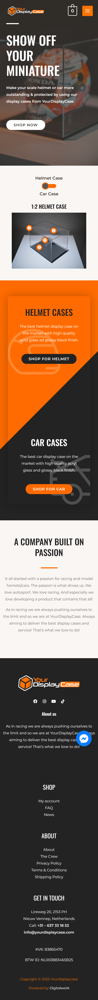
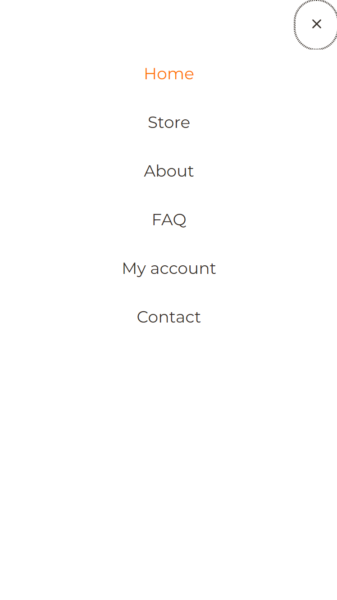

# Procesverslag
Markdown is een simpele manier om HTML te schrijven.  
Markdown cheat cheet: [Hulp bij het schrijven van Markdown](https://github.com/adam-p/markdown-here/wiki/Markdown-Cheatsheet).

Nb. De standaardstructuur en de spartaanse opmaak van de README.md zijn helemaal prima. Het gaat om de inhoud van je procesverslag. Besteedt de tijd voor pracht en praal aan je website.

Nb. Door *open* toe te voegen aan een *details* element kun je deze standaard open zetten. Fijn om dat steeds voor de relevante stuk(ken) te doen.

## Jij

  
uitwerken voor kick-off werkgroep

  ### Auteur:
  Nicholas Faas

  #### Je startniveau:
  Startniveau: Rood

  #### Je focus:
  Focus: Surface plane
 

## Je website

  
uitwerken voor kick-off werkgroep

  ### Je opdracht:
  https://www.yourdisplaycase.com/

  #### Screenshot(s) van de eerste pagina (small screen): 
  Home 
  

  #### Screenshot(s) van de tweede pagina (small screen):
  About 
  
 

## Toegankelijkheidstest 1/2 (week 1)

  
uitwerken na test in 2e werkgroep

  ### Bevindingen
  Lijst met je bevindingen die in de test naar voren kwamen:
  - HTML niet gevalideerd
  - Viewport zoom disabled
  - Skip heading levels
  - Images zonder alt atrtribute

## Breakdownschets (week 1)

  
uitwerken na afloop 3e werkgroep

  ### de hele pagina: 
  

  ### dynamisch deel (bijv menu): 
  

## Voortgang 1 (week 2)

  
uitwerken voor 1e voortgang

  ### Stand van zaken
  hier dit ging goed & dit was lastig (neem ook screenshots op van delen van je website en code)

  ### Agenda voor meeting
  samen met je groepje opstellen

  Nicholas
  - Hoe krijg ik een foto als achtergrond?
  - Ik wil een margin links en rechts voor de hele pagina behalve de achtergonden

  Daniel
  - Hoe zorg ik ervoor dat mijn afbeeldig veranderd wanneer het scherm groter wordt?
  - Hoe zet ik een linkje op een afbeelding?

  Ruby
  - Elementen hidden op scherm maar wel laten lezen door screenreaders
  
  Beyza
  - Ik wil een video toevoegen, maar ik wil niet dat deze automatisch begint wanneer je de pagina opent. Ik wil dat je zelf kunt klikken om de video te starten.

  ### Verslag van meeting
  hier na afloop snel de uitkomsten van de meeting vastleggen

  - background-image: url('../images/header.jpg'); i.p.v. background-image: url('images/header.jpg');
  - background-size: cover;
  - nog een punt
  - ...

## Voortgang 2 (week 3)

  
uitwerken voor 2e voortgang

  ### Stand van zaken
  hier dit ging goed & dit was lastig (neem ook screenshots op van delen van je website en code)

  ### Agenda voor meeting
  samen met je groepje opstellen

  Nicholas
  - Hoe centreer ik mij background-image?
  - Hoe krijg ik er een oranje en donkere transparantie over heen?

  Daniel
  - Geen vragen

  Ruby
  - Uitklap menu maken
  - Zijwaartse scroll door foto's
  - Vinkjes aan de linker kant van tekst
  - Border om section
  
  Beyza
  - Menu

  ### Verslag van meeting
  hier na afloop snel de uitkomsten van de meeting vastleggen

  - background-position: center;
  - background-image: url('../images/header.jpg'), linear-gradient(#0006 0 0); + background-blend-mode: overlay;
  - nog een punt
  - ...

## Toegankelijkheidstest 2/2 (week 4)

  
uitwerken na test in 9e werkgroep

  ### Bevindingen
  Lijst met je bevindingen die in de test naar voren kwamen (geef ook aan wat er verbeterd is):
  - Toegankelijkheidstest niet gedaan

## Voortgang 3 (week 4)

  
uitwerken voor 3e voortgang

  ### Stand van zaken
  hier dit ging goed & dit was lastig (neem ook screenshots op van delen van je website en code)

  ### Agenda voor meeting
  samen met je groepje opstellen

  Nicholas:
  - Geen vragen

  Daniel
  - Hoe kan ik ervoor zorgen dat wanneer mijn schermbreedte groter is, mijn grid aanpast van 1 naar 4 vakjes?

  Ruby
  - Geen vragen
  
  Beyza
  - Tekst aan afbeeldingen van hamburger menu toevoegen

## Eindgesprek (week 5)

  
uitwerken voor eindgesprek

  ### Je uitkomst - karakteristiek screenshots:
  

  ### Dit ging goed/Heb ik geleerd: 
  Korte omschrijving met plaatjes

  

  ### Dit was lastig/Is niet gelukt:
  Korte omschrijving met plaatjes

  

## Bronnenlijst

  
continu bijhouden terwijl je werkt

  Nb. Wees specifiek ('css-tricks' als bron is bijv. niet specifiek genoeg). 
  Nb. ChatGpT en andere AI horen er ook bij.
  Nb. Vermeld de bronnen ook in je code.

  1. https://codepen.io/mburnette/pen/LxNxNg
  2. https://codepen.io/shooft/pen/abmLPwy

